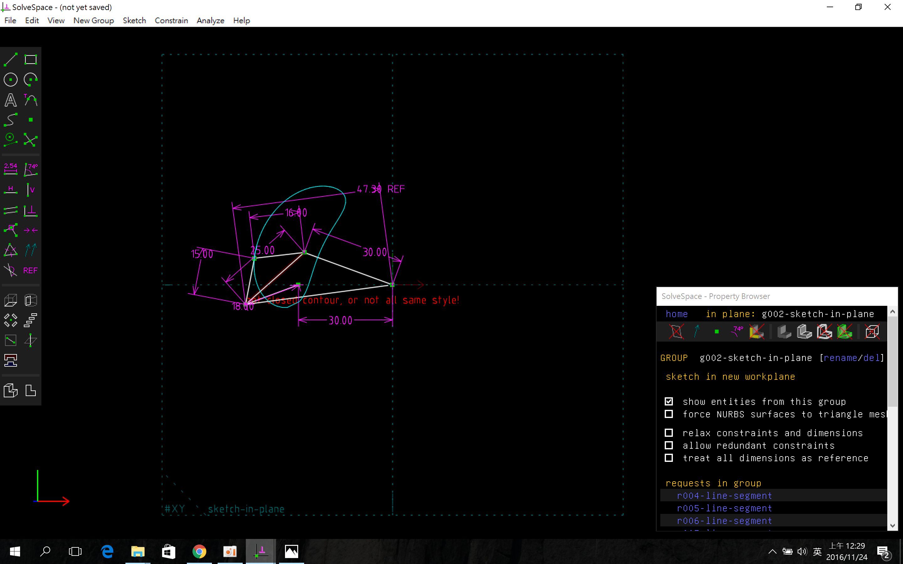
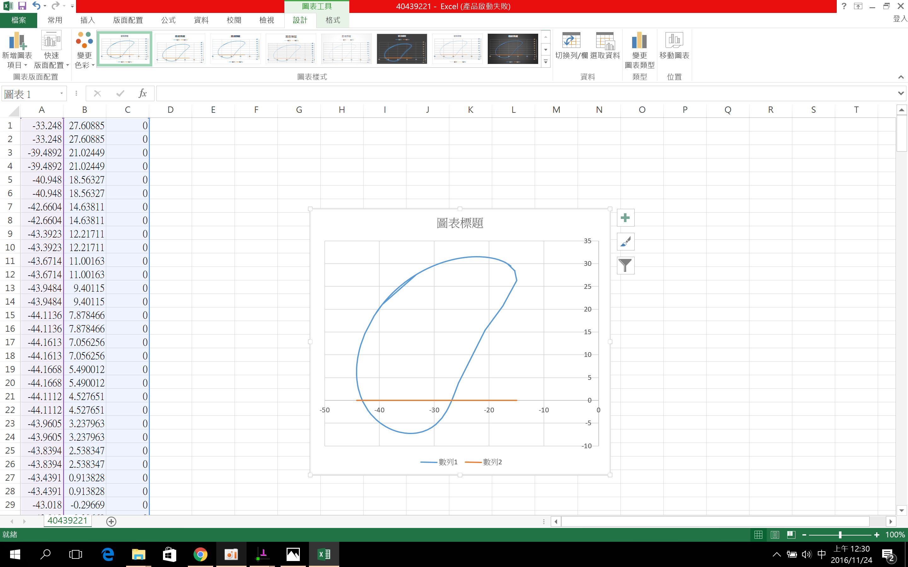

Title: 20161118W10
Date: 2016-11-18 12:00
Category: Misc
Tags: 上課內容, SolveSpace
Author: 40439221

<h2>有關 Solvespace 機構模擬功能介紹, 與 Python3 及 Brython 程式驗證</h2>

<!-- PELICAN_END_SUMMARY -->

利用 Solvespace Analyze-Trace Point-Stop Trace 得到繞行路徑:

將所得到的點座標 .csv 以 Excel 畫圖, 得到:
  

經過這次作業第一次了解到原來solvespace 有模擬功能!!!
  
