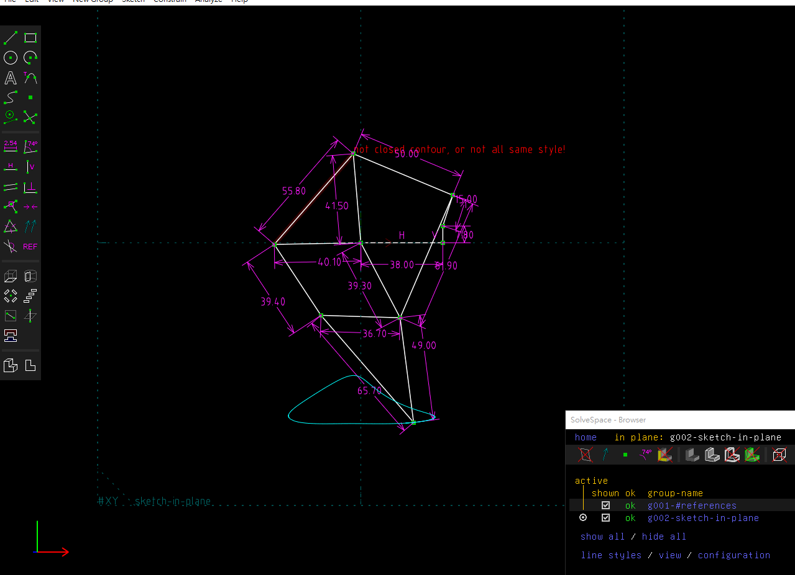
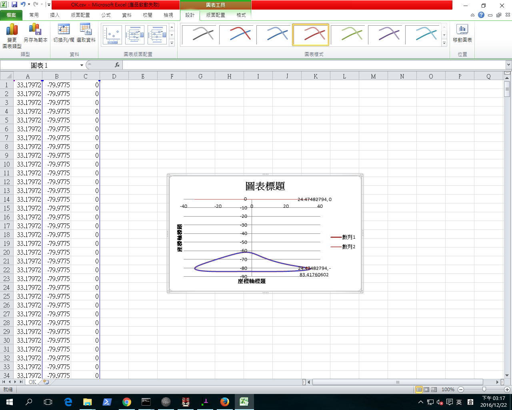

Title: 20161230W16
Date: 2016-12-30 12:00
Category: Misc
Tags: 上課內容, OnShape, SolveSpace
Author: 40439221
<h2>Linkages (四連桿與多連桿運動模擬):</h2>
<!-- PELICAN_END_SUMMARY -->
從這次作業的過程中我學習到，原來solvespace也可以做到模擬分析運動路徑的效果，相信這對未來走機械設計分析模擬上會是非常大的一個幫助

<iframe width="560" height="315" src="https://www.youtube.com/embed/tV-a0n61FzE" frameborder="0" allowfullscreen></iframe>

將所得到的點座標 .csv 以 Excel 畫圖, 得到:
  

